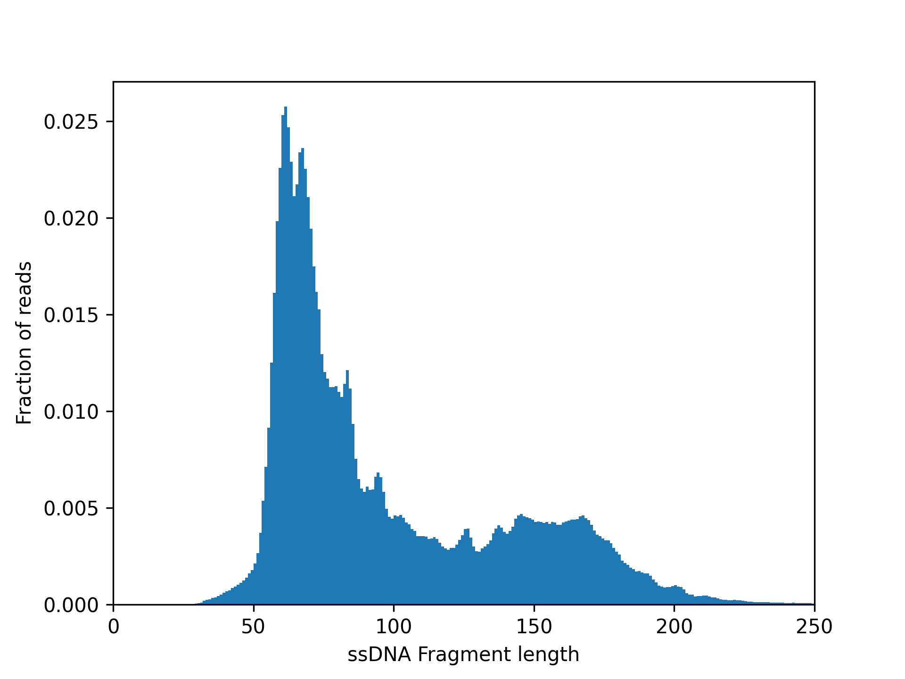
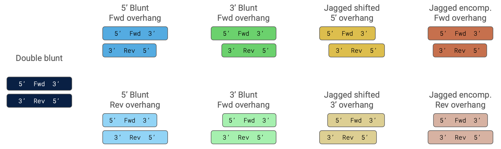
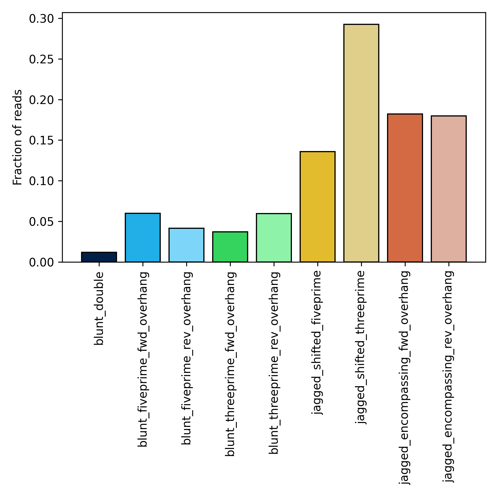
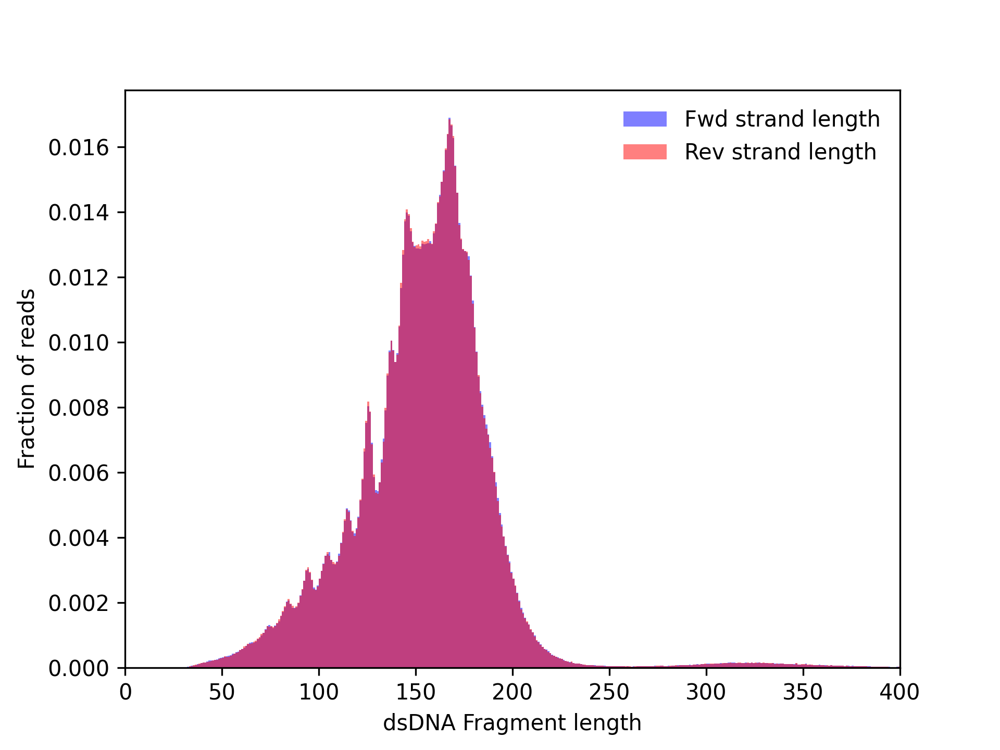

# Fragmentomics

CySeq allows you to explore the fragmentomics profile of a cell-free DNA sample.

!!! Note

    This section contains example plots and the code used to generate them. This requires the installation of an additional python library that is not  included in the default installation of `pycyseq`.

    You can install them in the same virtual environment you have install `pycyseq` by running: 
    
    `pip install matplotlib`
    

## Single-strand DNA

For the complete API on ssDNA see [`SingleStrandAligment`](./API/05_singlestrand.md).

### Fragment length

CySeq reads from Single-strand DNA (ssDNA) have single basepair accuracy length, we can therefore investigate the length of ssDNA molecules. The plot below shows the fragment length distribution from cfDNA collected from blood from an individual.



```python title="Code: ssDNA fragment length distribution example"
# import the necessary modules
from pycyseq import read_cyseq_alignment_file
from matplotlib import pyplot as plt

# extract the data from the bam file
ssdna_lengths = []
for alignment_group in read_cyseq_alignment_file(BAM_FILE):

    # include only alignments from ssDNA
    if alignment_group.is_ssdna:
        
        # take only the primary alignment (first), to not double-count cases
        # with supplementary alignments      
        aln = alignment_group[0]
        # do not include reads marked as duplicate
        if aln.is_duplicate:
            continue
        ssdna_lengths.append(aln.len)

# make the plot
fig, ax = plt.subplots()

bins = list(range(0, max(ssdna_lengths)))
ax.hist(
    x=ssdna_lengths,
    bins=bins,
    density=True,
)

ax.set_xlim(0, 250)
ax.set_xlabel("ssDNA Fragment length")
ax.set_ylabel("Number of reads")

plt.show()
```


## Double-strand DNA

CySeq reads from double-strand DNA (dsDNA) preserve the native overhangs of the molecules. We can investigate where these overhangs are located, the length of the dsDNA molecules, and the length of the overhangs.

For the complete API on dsDNA see [`DoubleStrandAlignment`](./API/04_doublestrand.md).

### Read types

dsDNA can be classified into 9 different types depending on the length and location of the overhangs. The image below shows a visual representation of the 9 different types.



The plot below shows the relative composition of dsDNA types from cfDNA collected from blood from an individual.



```python title="Code: read type distribution example"
# import the necessary modules
from pycyseq import read_cyseq_alignment_file
from matplotlib import pyplot as plt

read_types = {}
for alignment_group in read_cyseq_alignment_file(BAM_FILE):

    # include only alignments from ssDNA
    if alignment_group.is_dsdna:
        
        if alignment_group.has_rotations:
            continue
        aln = alignment_group[0]
        # do not include reads marked as duplicate
        if aln.is_duplicate:
            continue
        if aln.type not in read_types:
            read_types[aln.type] = 0
        read_types[aln.type] += 1

# make the plot
fig, ax = plt.subplots(figsize=(6, 6))

colors = {
    "blunt_double": "#002147",
    "blunt_fiveprime_fwd_overhang": "#22aee6",
    "blunt_fiveprime_rev_overhang": "#7dd6fa",
    "blunt_threeprime_fwd_overhang": "#35d45f",
    "blunt_threeprime_rev_overhang": "#8ff2a9",
    "jagged_shifted_fiveprime": "#e3bc2d",
    "jagged_shifted_threeprime": "#e0ce8b",
    "jagged_encompassing_fwd_overhang": "#d46a44",
    "jagged_encompassing_rev_overhang": "#deb0a0",
}

total = sum(read_types.values())
for i, (read_type, color) in enumerate(colors.items()):
    ax.bar(
        x=[i],
        height=[read_types[read_type]/total],
        color=color,
        edgecolor="black"
    )

ax.set_xticks(list(range(len(colors))))
ax.set_xticklabels(list(colors.keys()), rotation=90)
ax.set_ylabel("Fraction of reads")

fig.tight_layout()

plt.show()
```


### Fragment length



```python title="Code: dsDNA fragment length distribution example"
# import the necessary modules
from pycyseq import read_cyseq_alignment_file
from matplotlib import pyplot as plt

# extract the data from the bam file
dsdna_fwd_lengths = []
dsdna_rev_lengths = []
for alignment_group in read_cyseq_alignment_file(BAM_FILE):

    # include only alignments from ssDNA
    if alignment_group.is_dsdna:
        
        # exclude cases where more than one possible rotation exists
        if alignment_group.has_rotations:
            continue
        
        aln = alignment_group[0]
        
        # do not include reads marked as duplicate
        if aln.is_duplicate:
            continue
        
        dsdna_fwd_lengths.append(aln.length_fwd)
        dsdna_rev_lengths.append(aln.length_rev)

# make the plot
fig, ax = plt.subplots()

bins = list(range(0, max(dsdna_fwd_lengths)))
ax.hist(
    x=dsdna_fwd_lengths,
    bins=bins,
    alpha=0.5,
    color="blue",
    label="Fwd strand length",
    density=True,
)

ax.hist(
    x=dsdna_rev_lengths,
    bins=bins,
    alpha=0.5,
    color="red",
    label="Rev strand length",
    density=True,
)

ax.set_xlim(0, 400)
ax.set_xlabel("dsDNA Fragment length")
ax.set_ylabel("Fraction of reads")
ax.legend(frameon=False, loc="upper right")

plt.show()
```

